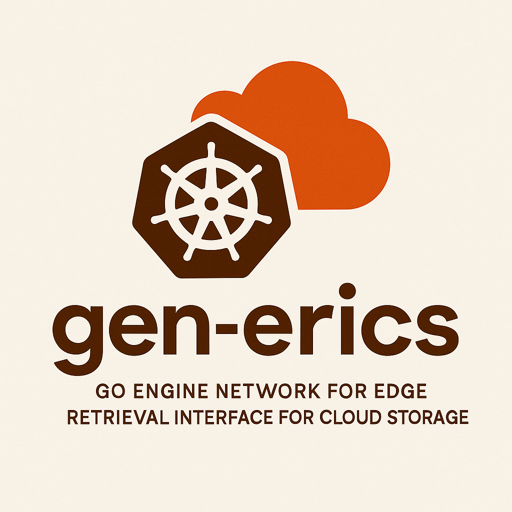

# gen-erics

## Overview

**g**-go
**e**-engine
**n**-network for
**e**-edge
**r**-retrieval
**i**-interface and
**c**-cloud
**s**-storage

Gen-erics is a cloud/edge DICOM image management system for medical imaging. It provides an API for intelligent tier-based storage management of DICOM studies, with a web-based viewing interface.

## Project Layout

```
gen-erics/
├── .github/
│   └── workflows/                      # GitHub CI/CD workflows
│       ├── build-deploy-dev.yaml
│       └── build-deploy-prod.yaml
│
├── backend/                            # Go Gin API server
│   ├── cmd/server/                     # Main application entry point
│   │   └── main.go
│   ├── internal/                       # Private application code
│   │   ├── api/                        # API handlers and routing
│   │   │   ├── handlers.go
│   │   │   └── routes.go
│   │   ├── config/                     # Configuration
│   │   │   └── config.go
│   │   ├── models/                     # Shared data models
│   │   │   └── types.go
│   │   ├── orthanc/                    # Orthanc REST client
│   │   │   ├── client.go
│   │   │   └── types.go
│   │   └── storage/                    # Storage layer (PostgreSQL)
│   │       └── postgres.go
│   ├── go.mod                          # Go module definition
│   ├── go.sum                          # Dependency checksums
│   └── Dockerfile                      # Multi-stage Dockerfile for Go backend
│
├── frontend/                           # DICOM Viewer web interface
│   ├── index.html                      # Main HTML page
│   ├── main.js                         # Core application logic
│   ├── style.css                       # Styling
│   ├── vite.config.js                  # Vite build configuration
│   ├── package.json                    # NPM dependencies
│   └── Dockerfile                      # Frontend container build
│
├── infrastructure/                     # Deployment configurations
│   ├── helm/                           # Helm charts
│   │   └── gen-erics/                  # Main application chart
│   │       ├── Chart.yaml
│   │       ├── values.yaml
│   │       ├── Chart.lock
│   │       ├── templates/              # Kubernetes manifests
│   │       │   ├── _helpers.tpl
│   │       │   ├── NOTES.txt
│   │       │   ├── backend-deployment.yaml
│   │       │   ├── backend-service.yaml
│   │       │   ├── frontend-deployment.yaml
│   │       │   ├── frontend-service.yaml
│   │       │   ├── orthanc-configmap.yaml
│   │       │   ├── orthanc-statefulset.yaml
│   │       │   ├── orthanc-services.yaml
│   │       │   └── tests/
│   │       │       └── test-connection.yaml
│   │       └── .helmignore
│   │
│   └── orthanc/                        # Orthanc configuration
│       └── orthanc.json                # Base Orthanc configuration
│
├── skaffold.yaml                       # Skaffold development config
└── README.md                           # This file
```

## Development Environment Setup

### Prerequisites

1. [Docker](https://docs.docker.com/get-docker/) or [Rancher Desktop](https://rancherdesktop.io/)
2. [kubectl](https://kubernetes.io/docs/tasks/tools/install-kubectl/)
3. [k3d](https://k3d.io/) for local Kubernetes 
4. [Helm](https://helm.sh/docs/intro/install/)
5. [Skaffold](https://skaffold.dev/docs/install/)

### Setting up the k3d Cluster

```bash
# Create a k3d cluster with port mappings
k3d cluster create dev-cluster \
  --agents 1 \
  --port '8080:80@loadbalancer' \
  --port '8443:443@loadbalancer' \
  --wait
```

### Setting up GitHub Container Registry Access

```bash
# Create a secret for pulling images from GitHub Container Registry
export K8S_NAMESPACE="default" # Or your target namespace
export GITHUB_USERNAME="YOUR_GITHUB_USERNAME" 
export GITHUB_PAT="YOUR_GENERATED_PAT" # Personal Access Token with package read rights
export SECRET_NAME="ghcr-pull-secret"

kubectl create secret docker-registry $SECRET_NAME \
  --namespace $K8S_NAMESPACE \
  --docker-server=ghcr.io \
  --docker-username=$GITHUB_USERNAME \
  --docker-password=$GITHUB_PAT \
  --docker-email=your.email@example.com
```

### Setting up Observability with SigNoz

```bash
# Install SigNoz for observability
helm install signoz signoz/signoz \
  --namespace observability \
  --create-namespace \
  --set frontend.ingress.enabled=true \
  --set 'frontend.ingress.hosts[0].host=signoz.local' \
  --set frontend.ingress.ingressClassName=traefik \
  --set global.storageClass=local-path \
  --wait
```

### Development with Skaffold

Skaffold automates the build-test-deploy workflow for local development:

1. **Initialize local environment**:
   
   First, verify your k3d cluster is running:
   ```bash
   kubectl cluster-info
   ```

2. **Configure Skaffold values file** (if not already done):
   
   Create a file at `infrastructure/gen-erics-values.yaml` with any overrides for the Helm chart.

3. **Development Mode**:
   
   Start Skaffold in development mode, which will:
   - Build the backend and frontend containers
   - Deploy the Helm chart with those images
   - Watch for file changes and automatically rebuild/redeploy

   ```bash
   skaffold dev
   ```

   This will:
   - Build the Docker images for backend and frontend
   - Deploy using Helm with your custom values
   - Stream logs from all pods to your console
   - Watch for file changes and automatically rebuild/redeploy

4. **One-time Build & Deploy**:

   If you just want to build and deploy once without watching for changes:
   ```bash
   skaffold run
   ```

5. **Accessing the Application**:

   Once deployed, access the application at:
   - Frontend: http://localhost:8080/
   - API: http://localhost:8080/api/v1/
   - SigNoz: http://signoz.local/ (requires /etc/hosts entry)

### Working on the Frontend

To initialize the frontend dependencies:

```bash
cd frontend
npm install
npm run dev
```

This will start a development server on http://localhost:5173/ with hot reloading.

### Working on the Backend

For backend development, you can use Go's native tools:

```bash
cd backend
go mod tidy
go run cmd/server/main.go
```

## Key Features

- **Tier-based Storage Management**: Move DICOM studies between hot, cold, and archive tiers
- **Integrated DICOM Viewer**: CornerstoneJS-based viewer for DICOM images
- **RESTful API**: API for managing DICOM studies and instances
- **Observability**: OpenTelemetry-based tracing, metrics, and logging

## API Endpoints

- `GET /api/v1/studies`: List all studies
- `GET /api/v1/studies/{studyUID}/location`: Get current storage location of a study
- `POST /api/v1/studies/{studyUID}/move`: Move a study to a different storage tier
- `GET /api/v1/studies/{studyUID}/instances`: List instances in a study
- `GET /api/v1/studies/{studyUID}/instances/{instanceUID}/file`: Get DICOM file
- `GET /api/v1/studies/{studyUID}/instances/{instanceUID}/preview`: Get image preview

## Database Schema

The application uses PostgreSQL to track study storage locations with a simple schema:

- `study_status` table:
  - `study_instance_uid` (primary key): DICOM Study Instance UID
  - `tier`: Current storage tier (hot, cold, archive)
  - `location_type`: Storage location type (edge, cloud)
  - `edge_id`: Specific edge device ID (if applicable)
  - `last_updated`: Timestamp of last update